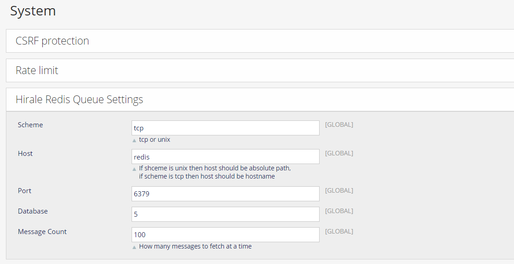

# Hirale Redis Queue Module

A module using Redis Stream to process asynchronous tasks.


## Install

### Install with [Magento Composer Installer](https://github.com/Cotya/magento-composer-installer)

```bash
composer require hirale/openmage-redis-queue
```

## Usage

### Setup

Go to openmage system config `System > Configuration > System > Hirale Redis Queue Settings`. 



### Quick start example

1. Create a new module, name it `Hirale_QueueExample`.
   `app/etc/modules/Hirale_QueueExample.xml`
   ``` xml
   <?xml version="1.0"?>
   <config>
       <modules>
           <Hirale_QueueExample>
               <active>true</active>
               <codePool>local</codePool>
               <depends>
                   <Hirale_Queue />
               </depends>
           </Hirale_QueueExample>
       </modules>
   </config>
   ```
2. Create `app/code/local/Hirale/QueueExample/etc/config.xml`.
   ```xml
   <?xml version="1.0"?>
    <config>
        <modules>
            <Hirale_QueueExample>
                <version>1.0.0</version>
            </Hirale_QueueExample>
        </modules>
        <global>
            <models>
                <hirale_queue_example>
                    <class>Hirale_QueueExample_Model</class>
                </hirale_queue_example>
            </models>
            <events>
                <controller_front_send_response_before>
                    <observers>
                        <hirale_queue_example_send_response_after>
                            <type>singleton</type>
                            <class>hirale_queue_example/observer</class>
                            <method>testExample</method>
                        </hirale_queue_example_send_response_after>
                    </observers>
                </controller_front_send_response_before>
            </events>
        </global>
    </config>
    ```
3. Creat a new task hanlder that implements `Hirale_Queue_Model_TaskHandlerInterface` class.
   `app/code/local/Hirale/QueueExample/Model/TestHandler.php`
   ```php
    <?php
        class Hirale_QueueExample_Model_TestHandler implements Hirale_Queue_Model_TaskHandlerInterface
        {

            public function handle($data)
            {
                Mage::log($data['id'] . ': ' . print_r($data, true), Zend_Log::INFO, 'example.log');
            }
        }
    ```

4. Create Observer to get the data from a event and add it to queue.
    `app/code/local/Hirale/QueueExample/Model/Observer.php`
    ```php
    <?php
        class Hirale_QueueExample_Model_Observer
        {
            public function testExample(Varien_Event_Observer $observer)
            {
                $currentRoute = $observer->getEvent()->getFront();
                Mage::getModel('hirale_queue/task')->addTask('Hirale_QueueExample_Model_TestHandler',
                ['route' => $currentRoute->getRequest()->getRequestString()]);
            }
        }
    ```
5. Clean cache and check examle.log, make sure your cron is running.
   ``` log
   2024-06-09T14:39:01+00:00 INFO (6): 1717943907550-0: Array
    (
        [id] => 1717943907550-0
        [handler] => Hirale_QueueExample_Model_TestHandler
        [data] => Array
            (
                [route] => /admin/customer/index/key/5232c0583f633e8d8d8c349ebb4639db/
            )

        [retry_count] => 3
        [retry_delay] => 60
        [timeout] => 60
    )

    2024-06-09T15:04:02+00:00 INFO (6): 1717945421857-0: Array
    (
        [id] => 1717945421857-0
        [handler] => Hirale_QueueExample_Model_TestHandler
        [data] => Array
            (
                [route] => /admin/customer/index/key/5232c0583f633e8d8d8c349ebb4639db/
            )

        [retry_count] => 3
        [retry_delay] => 60
        [timeout] => 60
    )
    ```

## License

The Open Software License v. 3.0 (OSL-3.0). Please see [License File](LICENSE.md) for more information.
