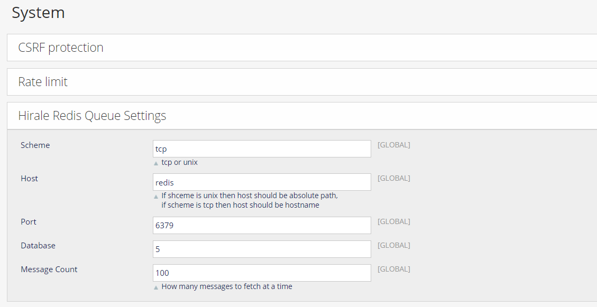

# Hirale Redis Queue Module

A community-scope module using Redis Streams to process asynchronous tasks in OpenMage and Maho.

## Modules that depend on this module

| Module | URL |
| --- | --- |
| Google Analytics 4 Measurement Protocol | [openmage-ga4-measurement](https://github.com/hirale/openmage-ga4-measurement) |
| Meta Conversions API | [openmage-meta-conversions](https://github.com/hirale/openmage-meta-conversions) |

## Install

## Compatibility

| Module line | Platform support | Logger API |
| --- | --- | --- |
| Current / next major | Maho 25.9+ or OpenMage 20.17+ | Monolog-backed `Mage::log()` |
| Legacy 1.x | Older Maho/OpenMage/Magento 1 installations | Zend_Log-backed `Mage::log()` |

The current module line declares Composer conflicts for `mahocommerce/maho <25.9`
and `openmage/magento-lts <20.17`, because this code uses Monolog log levels.
Keep older installations pinned to the legacy 1.x module line.

### Install with Composer

```bash
composer require hirale/openmage-redis-queue
```

The package is installed in the `community` code pool so projects can override or extend behavior from the `local` code pool.

Maho projects satisfy `magento-hackathon/magento-composer-installer` through `mahocommerce/maho`'s Composer `replace` rule and load the mapped files through the Maho Composer plugin. OpenMage projects install the Magento Composer Installer and apply the same `extra.map` into `app/code/community`.

Runtime platform differences are isolated behind `hirale_queue/platform_factory`; queue handlers should depend on shared queue APIs and only use the platform adapter for behavior that differs between Maho and OpenMage.

From version 1.1.0, admin configuration moved from
`System > Configuration > System > Hirale Redis Queue Settings` to
`System > Configuration > Hirale > Queue`. The setup migration copies saved
values from `system/hirale_queue/*` to `hirale_queue/settings/*` without
overwriting values already saved at the new paths.

## Development

Install dev dependencies and run the package test suite:

```bash
composer update
composer test
```

The test suite uses PHPUnit with local Mage test doubles, so it does not need a
running Maho/OpenMage application or Redis server.

## Usage

### Setup

Go to system config `System > Configuration > Hirale > Queue`.



### Quick start example

1. Create a new module, name it `Hirale_QueueExample`.
   `app/etc/modules/Hirale_QueueExample.xml`
   ``` xml
   <?xml version="1.0"?>
   <config>
       <modules>
           <Hirale_QueueExample>
               <active>true</active>
               <codePool>local</codePool>
               <depends>
                   <Hirale_Queue />
               </depends>
           </Hirale_QueueExample>
       </modules>
   </config>
   ```
2. Create `app/code/local/Hirale/QueueExample/etc/config.xml`.
   ```xml
   <?xml version="1.0"?>
    <config>
        <modules>
            <Hirale_QueueExample>
                <version>1.0.0</version>
            </Hirale_QueueExample>
        </modules>
        <global>
            <models>
                <hirale_queue_example>
                    <class>Hirale_QueueExample_Model</class>
                </hirale_queue_example>
            </models>
            <events>
                <controller_front_send_response_before>
                    <observers>
                        <hirale_queue_example_send_response_after>
                            <type>singleton</type>
                            <class>hirale_queue_example/observer</class>
                            <method>testExample</method>
                        </hirale_queue_example_send_response_after>
                    </observers>
                </controller_front_send_response_before>
            </events>
        </global>
    </config>
    ```
3. Create a new task handler that implements `Hirale_Queue_Model_TaskHandlerInterface`.
   `app/code/local/Hirale/QueueExample/Model/TestHandler.php`
   ```php
    <?php
        use Monolog\Level;

        class Hirale_QueueExample_Model_TestHandler implements Hirale_Queue_Model_TaskHandlerInterface
        {
            public function handle(array $data): void
            {
                Mage::log($data['id'] . ': ' . print_r($data, true), Level::Info, 'example.log');
            }
        }
    ```

4. Create Observer to get the data from a event and add it to queue.
    `app/code/local/Hirale/QueueExample/Model/Observer.php`
    ```php
    <?php
        class Hirale_QueueExample_Model_Observer
        {
            public function testExample($observer)
            {
                $currentRoute = $observer->getEvent()->getFront();
                Mage::getModel('hirale_queue/task')->addTask('hirale_queue_example/testHandler',
                ['route' => $currentRoute->getRequest()->getRequestString()]);
            }
        }
    ```
5. Enable queue processing in system config, clean cache, and check example.log. Make sure cron is running.
   ``` log
   2024-06-09T14:39:01+00:00 INFO (6): 1717943907550-0: Array
    (
        [id] => 1717943907550-0
        [handler] => hirale_queue_example/testHandler
        [data] => Array
            (
                [route] => /admin/customer/index/key/5232c0583f633e8d8d8c349ebb4639db/
            )

        [retry_count] => 3
        [retry_delay] => 60
        [timeout] => 60
    )

    2024-06-09T15:04:02+00:00 INFO (6): 1717945421857-0: Array
    (
        [id] => 1717945421857-0
        [handler] => hirale_queue_example/testHandler
        [data] => Array
            (
                [route] => /admin/customer/index/key/5232c0583f633e8d8d8c349ebb4639db/
            )

        [retry_count] => 3
        [retry_delay] => 60
        [timeout] => 60
    )
    ```

## License

The Open Software License v. 3.0 (OSL-3.0). Please see [License File](LICENSE.md) for more information.
